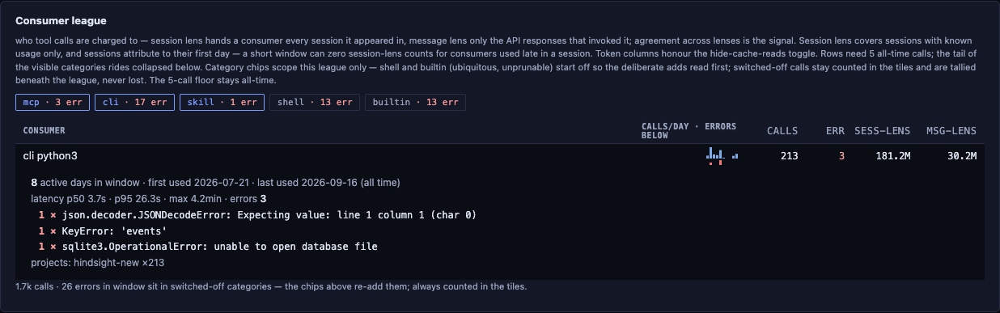
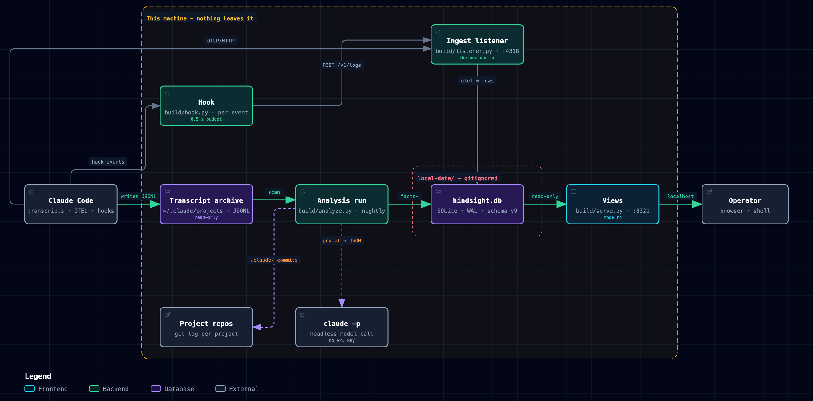

# Hindsight

Local observability over Claude Code history, built for a solo, skill-heavy operator: **what** was done, **where** the tokens went, and **how** the process ran. Read-only, stdlib-only Python over SQLite — everything is derived from the transcripts and telemetry already on the machine, and the derived data never leaves it.

**What — the cross-project session ledger.** One row per session: what was done and what was decided, setup changes, with the evidence a click away.


**Where — the token dashboard.** Cache economics, consumer league (skills / MCP / CLI), models and latency, reliability, and the sunk cost every session pays at start.


Every error count in the league has the errors behind it. Opening a consumer's row lists them grouped by their error line, count-first, with the verbatim text and the session behind each occurrence one click away; a category chip carries its in-window error count whether it is on or off, so a switched-off category's errors are stated, never silent. An error whose transcript was pruned before capture is counted and read as *text not captured* — unknown is never zero.



**How — the process trail.** One project's declared process beside what actually happened: phase runs, a model-written status narrative, and the mechanical trail behind it. Work that matches no declared stage is off-script, and it is shown rather than hidden: listed beside the stated process, tallied on every run, and forming runs of its own when nothing declared was going on.


## What it is for

Three questions about a heavy Claude Code setup that nothing on disk answers directly: where the tokens went, what was actually done, and how you followed your general process, or didn't. Hindsight answers them from the transcripts and telemetry already on the machine — no account, no upload, no daemon beyond an optional listener. The audience is you, reviewing your own history, and the product is built to that bar.

Everything runs on the operator's machine and nothing leaves it: Claude Code writes the transcripts, an analysis run reads them and calls the `claude` CLI for the model pass, and the views read the resulting database on localhost.



Why it exists, who reads this repo, how it was built and what was reversed along the way: [background/why.md](background/why.md). The full working record ships with the code — [88 tickets](background/tickets/), the phase documents under [background/](background/), the twenty-seven decision records in [docs/adr/](docs/adr/), the reviewability docs in [docs/](docs/architecture.md), and the domain vocabulary in [CONTEXT.md](CONTEXT.md).

## Run it

macOS is assumed throughout, and stated rather than worked around — the optional background pieces are launchd jobs, and nothing else has been written. Requirements: `python3` (3.9+ verified; stdlib only, so no pip and no venv), `git`, and the `claude` CLI on PATH. The three steps below were proven on a clean environment before publication — an empty machine state reaches all three views with zero console errors.

1. **Clone.** `git clone <repo> && cd hindsight`. There is no build step.
2. **Analyse.** `python3 build/analyze.py` — creates `local-data/` and the database, syncs every transcript under `~/.claude/projects`, and runs the model pass over them. With no transcripts at all it completes cleanly (exit 0). The first run is also the backfill: months of existing history go through the same pipeline, so it may hit your subscription's usage limits and pause — limit exhaustion is a designed state, not a failure: unfinished sessions stay pending and the next run resumes where it left off. A transcript modified in the last five minutes is a live session and waits for a later run; if `claude` is not resolvable, model calls take the same designed pause — one stderr line, exit 0, the mechanical scans still land — which is the pause path the clean-environment run actually exercised.
3. **Serve.** `python3 build/serve.py`, then `http://127.0.0.1:8321/what`. Read-only, bound to localhost. Run before step 2 it refuses with `no database at <path> — run an analysis first`, and that is by design — a listener-only database gets the same answer.

Everything else is optional and on-demand, and its absence degrades to honesty rather than a crash — the coverage window: OTEL-fed panels state when continuous capture began instead of presenting the gap as a zero.

- **Ingest listener.** `python3 build/listener.py install` writes and starts a launchd agent (`com.hindsight.ingest`) receiving OTEL telemetry on `127.0.0.1:4318`. It takes `application/json` only and caps a body at 8 MiB — the loopback bind keeps other machines out, and the content-type check keeps out a web page you happen to visit, which could otherwise post a cross-origin form body at it without a preflight (#34). No authentication beyond that: the trust boundary is the machine. Claude Code emits nothing until told to — the env block for `~/.claude/settings.json`, verified live against a real session during the definition phase:

  ```json
  "env": {
    "CLAUDE_CODE_ENABLE_TELEMETRY": "1",
    "OTEL_LOGS_EXPORTER": "otlp",
    "OTEL_METRICS_EXPORTER": "otlp",
    "OTEL_EXPORTER_OTLP_PROTOCOL": "http/json",
    "OTEL_EXPORTER_OTLP_ENDPOINT": "http://127.0.0.1:4318",
    "OTEL_LOG_TOOL_DETAILS": "1"
  }
  ```

- **Self-instrumentation hook.** Per-firing cost for the where-view's hook panel — OTEL emits no hook telemetry, so this is that panel's only source. The registration snippet is in [build/hook.py](build/hook.py)'s docstring; note the command path in it is absolute. Unregistered, the panel renders headers over no rows; registered with no listener running, the hook exits silently in ~0.13 s.
- **Menu bar status.** `python3 build/menubar.py install` writes a wrapper into [SwiftBar](https://swiftbar.app)'s plugin folder that runs the repo script (`brew install --cask swiftbar`; the host is a third-party app because ADR-0001 allows Hindsight one background process). The icon shows whether the listener and the views server answer, with a count of open schema-drift notices; the menu starts or stops either process, opens the what view, and acknowledges a notice in one click. Blue is fine, red is a problem-tier notice, grey means one of the two is down. A server started from the menu is the same on-demand `serve.py`, detached with its output in `~/Library/Logs/hindsight/serve.log`, gone at logout.
- **Nightly analysis.** `python3 build/analyze.py install` schedules the analysis daily at 03:00 (launchd runs it on wake if the Mac was asleep, skips it if powered off); `uninstall` removes it. This is the one optional piece not exercised live in the clean-environment run — it installs a real launchd job, so it was verified by code reading only.
- **Attribute pre-hook history.** A project is its folder, not its name (ADR-0018): with the hook installed, a rename keeps a project's history together. Sessions that predate the hook carry no folder identity and keep the name they were synced under, so after renaming a folder, stamp them once: `python3 build/analyze.py attribute <synced-name> <folder> [--before <ISO-8601>]`. It refuses a folder that does not exist or lies outside the workspace root, prints how many sessions it stamped, never overwrites a session that already has an identity, and does not itself re-key — the next analysis run files them under the folder's current name. `--before` bounds it to sessions whose first transcript record precedes that instant, for a name that was later reused by a different folder; a session whose transcript has been pruned is decided by its stored day when that day is strictly before the bound's, and left alone on the bound's own day — so in a two-call repair it lands wherever the second, unbounded call points; check the ledger for that day first.
- **Schema-drift guard.** The transcript format is an unversioned dependency (ADR-0020). Each run compares the shape of the newest record version with the last, against the field contract at the top of [build/substrate.py](build/substrate.py); a change is a *breakage* banner on every view (red when the rows since may be thin, blue when upstream merely added a key) and, from the command line, a macOS notification for the red kind. Ingest never halts on it. `python3 build/analyze.py acknowledge-breakage <id>` closes a row and makes its version the comparison baseline; it never rescans — a parser fix is a code change plus a schema bump.

**Hard-wired to the author's Mac** — every machine-specific assumption a second user would have to change:

- The hook registration snippet's command paths ([build/hook.py:21-25](build/hook.py#L21-L25)) are a placeholder (`/path/to/hindsight`) — substitute your clone's absolute path.
- `~/Documents/Claude`, one directory per project repo, is the assumed workspace layout (`--projects-dir` overrides). Sunk-cost workspace scanning and project-presence observation read it; when absent, both skip silently.
- `~/.claude` is assumed as Claude Code's home: transcripts under `~/.claude/projects` (`--root` overrides), the config-snapshot surface at `~/.claude` itself (`--claude-dir`).
- The model pin is `claude-haiku-4-5-20251001`, called through `claude -p` — your subscription needs that model available.
- Ports `4318` (listener — keep it matching the `OTEL_EXPORTER_OTLP_ENDPOINT` env var) and `8321` (serve) are defaults, each overridable with `--port`.
- Day buckets follow the Mac's clock zone. `HINDSIGHT_TZ=America/New_York` (any IANA name) pins them to a zone instead — for a travelling laptop, or a "my day" that is not the machine's; export it in the shell that runs `serve.py`, and before `analyze.py install` so the nightly carries it. An unknown name warns once and uses the host zone. Charts and the ledger re-bucket on the next reload — the ledger files each session under the days its usage fell on, so it never sits a day off its bars; only a continuation note's *started* day waits for the next analysis run to catch up.
- Both launchd plists bake install-time absolutes: the installing Python's path in both, and the installing shell's PATH (and `HINDSIGHT_TZ`, if set) in the nightly one — launchd's default PATH lacks `claude`, which is exactly the failure mode the step-2 pause exists for. Re-run the install after moving the clone or changing Python.

**Privacy.** The database is transcript-derived text: conversational extracts, model-written audit entries, content-addressed snapshots of your `~/.claude` config surface, and one kind of transcript content — the result text of a failed tool call, kept verbatim so the error behind a count can be read (ADR-0027; nothing of a successful call is ever stored). All of it lives in `local-data/`, which is gitignored and never leaves the machine; the server is read-only and binds `127.0.0.1`. The one outbound path is the analysis itself: session extracts go to the model through your own `claude` CLI — the same account and the same trust boundary as the sessions that produced them.

**Deferred, deliberately.** No installer, no `uvx`, no Linux/systemd port. The stated demand is one user, so the manual path is documented instead of automated: documentation costs a reader minutes, an installer costs standing maintenance against a moving Claude Code. Both are cheap to reverse the day a real second user appears.

## License

[MIT](LICENSE).
