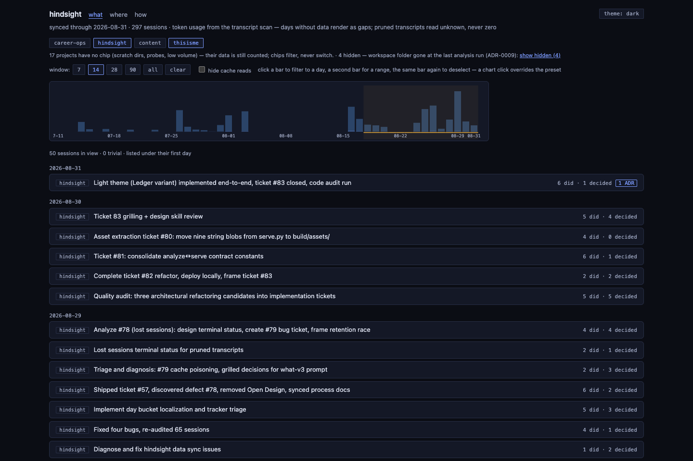
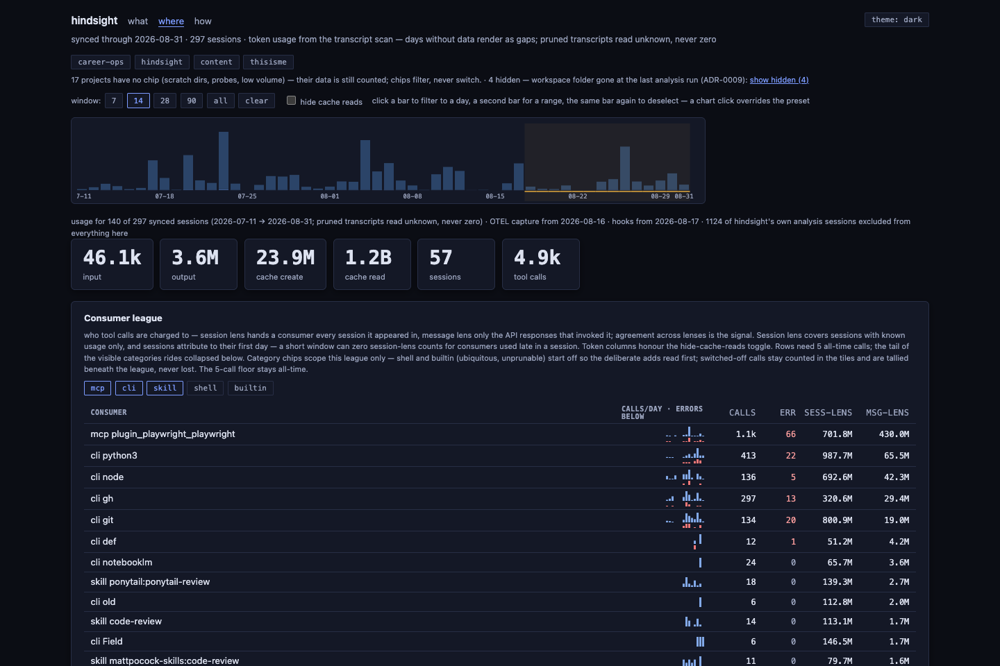
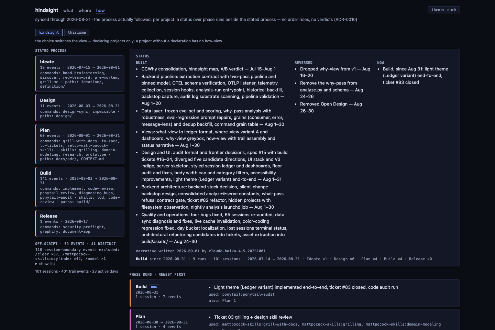

# Hindsight

Local observability over Claude Code history, built for a solo, skill-heavy operator: **what** was done, **where** the tokens went, and **how** the process ran. Read-only, stdlib-only Python over SQLite — everything is derived from the transcripts and telemetry already on the machine, and the derived data never leaves it.

**What — the cross-project session ledger.** One row per session: what was done and what was decided, setup changes, with the evidence a click away.



**Where — the token dashboard.** Cache economics, consumer league (skills / MCP / CLI), models and latency, and the sunk cost every session pays at start.



**How — the process trail.** One project's declared process beside what actually happened: phase runs, a model-written status narrative, and the mechanical trail behind it.



## Why

I run a skill- and MCP-heavy Claude Code setup across many independent projects, and I evolve that setup constantly. Three questions about my own usage were unanswerable from anything on disk: where did my tokens go (cache economics, the sunk session-start cost each project pays, per-skill and per-MCP usage); what did I actually do (an audit of actions and decisions per session, reviewable months later); and how did the process actually run against what was declared. Hindsight answers them from local history alone.

The demand is one user — me — and that is stated rather than hidden. The bar for a personal tool is acted-upon insights, not interest. A previous incarnation, limited in functionality and in retrospect a learning exercise, cleared that bar: its findings drove a real skills cleanup and a full project restructure. Both of those acted-upon insights were setup-evolution events, which argued for centring this product on the audit trail rather than the token dashboard — token reporting is steadily commoditised by first-party tooling, while only a local tool over full history can reconstruct decisions across months.

The build carried a second, stated purpose: an end-to-end evaluation of the process and toolchain it was built with. That working record — 88 tickets, the phase documents, the throwaway prototypes, the full commit history — lives in the private working repo this application was exported from. What ships here alongside the code is the part of the record with teeth: the seventeen decision records in [docs/adr/](docs/adr/) and the domain vocabulary in [CONTEXT.md](CONTEXT.md).

## How it was built

The build ran in phases — ideation → definition → design → build — governed by a per-project process declaration that the tooling itself reads: the how-view screenshot above is hindsight rendering its own declared process against its own trail.

- **Ideate.** Six forcing questions against the premise before any divergence, then an eval gate before commitment: a cheap-model run over real transcript days that confirmed the wedge and falsified an assumption — model-quoted evidence failed verbatim verification, so evidence is attached mechanically and model-quoted text is never stored as evidence.
- **Design.** Prototype-first for a dense tool UI: greybox screens on real data settled the information architecture before any styling, then five candidate directions were diverged and narrowed comparatively — three variants of the winner, identical real content in every comp — into the indigo deck recorded in [ADR-0007](docs/adr/0007-direction-indigo-deck.md), with [design/tokens.css](design/tokens.css) as the single styling contract.
- **Build.** A map of tracer-bullet tickets, one per session, each interrogated up front, built red-green, and reviewed before commit. Vocabulary lives in [CONTEXT.md](CONTEXT.md); every decision with teeth is an ADR in [docs/adr/](docs/adr/).
- **Evaluation as a recurring discipline, not a stage.** Wherever model output is load-bearing: a frozen eval set drawn from real data ([eval/](eval/)), a numeric threshold decided in advance, and a regression run on any prompt change.

Two reversals, told plainly, because the record is the point:

- **The why-view was dropped wholesale** ([ADR-0006](docs/adr/0006-v1-scope-two-views.md)). The product was framed as three views; putting real pages side by side showed the why-view's prose near-duplicated the what ledger while carrying almost the entire standing eval burden. The clean cut won over a merge.
- **28 sessions retried forever** ([ADR-0015](docs/adr/0015-lost-sessions-terminal-status.md)). Transcripts aged past Claude Code's retention while sessions waited behind a rate-limit pause, and the queue had no state meaning *unknowable*. The fix was a terminal `lost` status decided by an existence test, greedy extraction ahead of the model loop so the race cannot recur, and honest ledger rows — *transcript pruned before analysis, unrecoverable* — instead of silence.

## Run it

macOS is assumed throughout, and stated rather than worked around — the optional background pieces are launchd jobs, and nothing else has been written. Requirements: `python3` (3.9+ verified; stdlib only, so no pip and no venv), `git`, and the `claude` CLI on PATH. The three steps below were proven on a clean environment before publication — an empty machine state reaches all three views with zero console errors.

1. **Clone.** `git clone <repo> && cd hindsight`. There is no build step.
2. **Analyse.** `python3 build/analyze.py` — creates `local-data/` and the database, syncs every transcript under `~/.claude/projects`, and runs the model pass over them. With no transcripts at all it completes cleanly (exit 0). The first run is also the backfill: months of existing history go through the same pipeline, so it may hit your subscription's usage limits and pause — limit exhaustion is a designed state, not a failure: unfinished sessions stay pending and the next run resumes where it left off. A transcript modified in the last five minutes is a live session and waits for a later run; if `claude` is not resolvable, model calls take the same designed pause — one stderr line, exit 0, the mechanical scans still land — which is the pause path the clean-environment run actually exercised.
3. **Serve.** `python3 build/serve.py`, then `http://127.0.0.1:8321/what`. Read-only, bound to localhost. Run before step 2 it refuses with `no database at <path> — run an analysis first`, and that is by design — a listener-only database gets the same answer.

Everything else is optional and on-demand, and its absence degrades to honesty rather than a crash — the coverage window: OTEL-fed panels state when continuous capture began instead of presenting the gap as a zero.

- **Ingest listener.** `python3 build/listener.py install` writes and starts a launchd agent (`com.hindsight.ingest`) receiving OTEL telemetry on `127.0.0.1:4318`. Claude Code emits nothing until told to — the env block for `~/.claude/settings.json`, verified live against a real session during the definition phase:

  ```json
  "env": {
    "CLAUDE_CODE_ENABLE_TELEMETRY": "1",
    "OTEL_LOGS_EXPORTER": "otlp",
    "OTEL_METRICS_EXPORTER": "otlp",
    "OTEL_EXPORTER_OTLP_PROTOCOL": "http/json",
    "OTEL_EXPORTER_OTLP_ENDPOINT": "http://127.0.0.1:4318",
    "OTEL_LOG_TOOL_DETAILS": "1"
  }
  ```

- **Self-instrumentation hook.** Per-firing cost for the where-view's hook panel — OTEL emits no hook telemetry, so this is that panel's only source. The registration snippet is in [build/hook.py](build/hook.py)'s docstring; note the command path in it is absolute. Unregistered, the panel renders headers over no rows; registered with no listener running, the hook exits silently in ~0.13 s.
- **Nightly analysis.** `python3 build/analyze.py install` schedules the analysis daily at 03:00 (launchd runs it on wake if the Mac was asleep, skips it if powered off). This is the one optional piece not exercised live in the clean-environment run — it installs a real launchd job, so it was verified by code reading only.

**Hard-wired to the author's Mac** — every machine-specific assumption a second user would have to change:

- The hook registration snippet's command paths ([build/hook.py:21-25](build/hook.py#L21-L25)) are the original clone path — substitute your own.
- `~/Documents/Claude`, one directory per project repo, is the assumed workspace layout (`--projects-dir` overrides). Sunk-cost workspace scanning and project-presence observation read it; when absent, both skip silently.
- `~/.claude` is assumed as Claude Code's home: transcripts under `~/.claude/projects` (`--root` overrides), the config-snapshot surface at `~/.claude` itself (`--claude-dir`).
- The model pin is `claude-haiku-4-5-20251001`, called through `claude -p` — your subscription needs that model available.
- Ports `4318` (listener — keep it matching the `OTEL_EXPORTER_OTLP_ENDPOINT` env var) and `8321` (serve) are defaults, each overridable with `--port`.
- Both launchd plists bake install-time absolutes: the installing Python's path in both, and the installing shell's PATH in the nightly one — launchd's default PATH lacks `claude`, which is exactly the failure mode the step-2 pause exists for. Re-run the install after moving the clone or changing Python.

**Privacy.** The database is transcript-derived text: conversational extracts, model-written audit entries, and content-addressed snapshots of your `~/.claude` config surface. All of it lives in `local-data/`, which is gitignored and never leaves the machine; the server is read-only and binds `127.0.0.1`. The one outbound path is the analysis itself: session extracts go to the model through your own `claude` CLI — the same account and the same trust boundary as the sessions that produced them.

**Deferred, deliberately.** No installer, no `uvx`, no Linux/systemd port. The stated demand is one user, so the manual path is documented instead of automated: documentation costs a reader minutes, an installer costs standing maintenance against a moving Claude Code. Both are cheap to reverse the day a real second user appears.

## License

[MIT](LICENSE).
