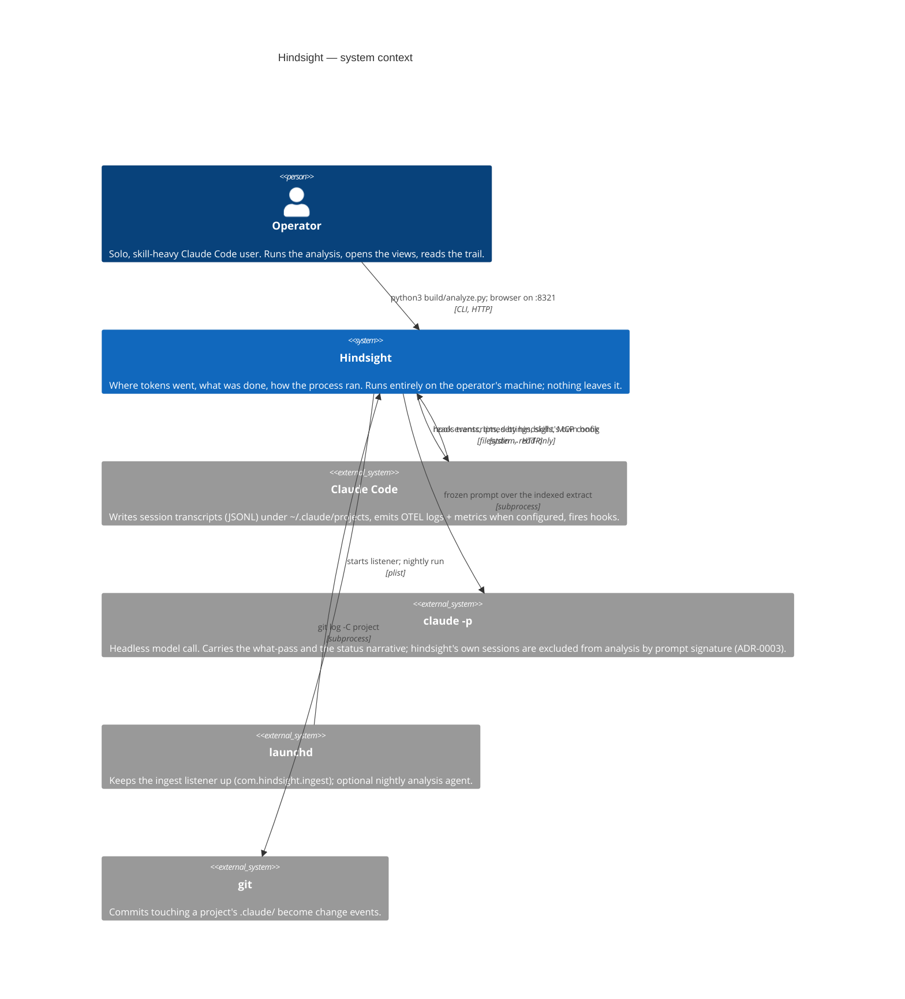
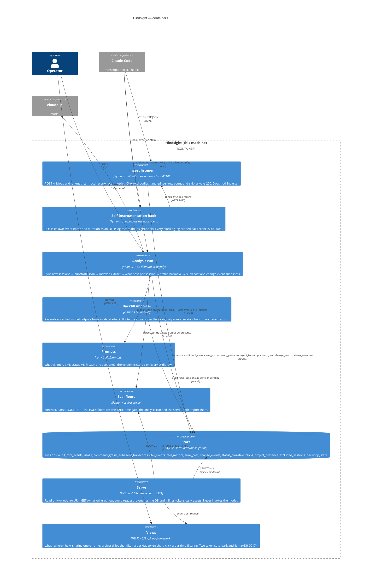
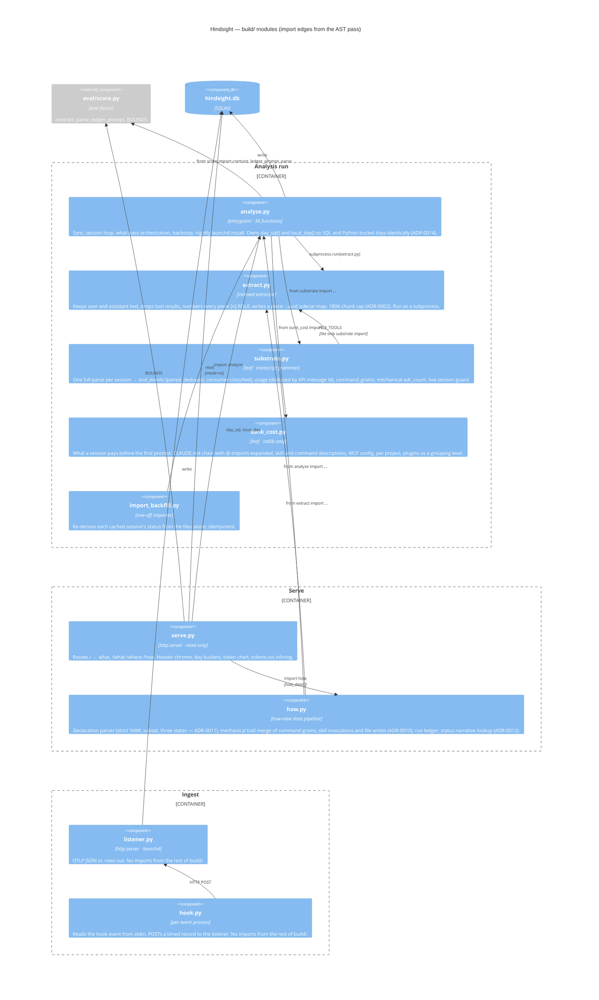

# Architecture — C4

Local observability over Claude Code history for one operator. Three levels: who and what
it talks to, the runnable pieces and the store between them, and the Python modules behind
the analysis run and the server.

**Basis (2026-09-04):** an AST pass over `build/*.py` using graphify's own extractor
(213 nodes / 423 edges), module docstrings, and ADR-0001 → 0017. The `/graphify .` run
itself contains none of this — graphify skips any directory named `build` as build output,
so its graph knows the architecture only through the ADRs.

Re-derive when a module is added, split, or gains a cross-directory import; the L3 edges
are the AST's, not intentions. Vocabulary is in [CONTEXT.md](../CONTEXT.md); each decision
cited below is in [adr/](adr/).

## L1 — System context

- **No daemon beyond the listener.** ADR-0001: the ingest listener is the one sanctioned background process. Everything else is on-demand foreground, started to look and closed when done.
- **The model is a subprocess, not a service.** No API key, no SDK — `claude -p` on PATH, serial, one call at a time. Missing CLI pauses the run rather than crashing it (ticket #84).
- **Nothing is written back to Claude Code.** Transcripts and config are read; the only outbound write is the hook's POST into hindsight's own listener.

## L2 — Containers

- **Write and read never share a process.** Ingest and analysis write; serve opens the DB read-only and has no run button (ADR-0008). Refresh is a browser reload.
- **Two ingest paths, one store.** OTEL arrives live through the listener; transcripts are parsed after the fact by the analysis run. Both land in SQLite and the where-view joins them.
- **`eval/` is a runtime dependency, not just a test suite.** `analyze.py` puts `eval/` on `sys.path` and imports `score`; the eval floors gate what gets written. This is the one cross-directory import in the system.
- **The design contract is inlined, not linked.** `design/tokens.css` is read by serve at render time, so a token edit shows on next reload with no build step.

## L3 — Components: the `build/` Python modules

- **Import direction is enforced by design, not tooling.** `substrate.py` and `sunk_cost.py` are declared leaves (ticket #82): analyze imports them, never the reverse. The AST confirms it — neither imports anything from `build/` except substrate's single `FILE_TOOLS` pull from extract.
- **Ingest is fully decoupled.** `listener.py` and `hook.py` share no code with the analysis or serve side; their only coupling is the `otel_events` table shape.
- **`analyze.py` is the god module.** 36 functions, the sync loop, the model call, the schema (`CREATE TABLE` for all fourteen tables), and the launchd install all live there. Serve and how both reach into it for day bucketing. It is the obvious candidate if a split is ever wanted — the day helpers and the schema are the two seams.
- **Prompts and assets are data.** `build/prompts/*.txt` and `build/assets/*` are read at run time; no module owns them beyond the path constant.

## Stack

| Layer | Choice | Where |
| --- | --- | --- |
| Language | Python 3 stdlib only — no pip dependencies (ADR-0003) | `build/*.py`, `eval/score.py` |
| Store | SQLite, one file `local-data/hindsight.db`; schema and migrations owned by `analyze.py` (`PRAGMA user_version`) | `build/analyze.py:160-410` |
| HTTP | `http.server.ThreadingHTTPServer`, twice: ingest `:4318` and serve `:8321`, both bound to `127.0.0.1` | `build/listener.py:181`, `build/serve.py:618` |
| Model | `claude -p --model claude-haiku-4-5-20251001` as a subprocess, prompt on stdin, 300 s timeout | `build/analyze.py:745` |
| Scheduling | launchd user agents `com.hindsight.ingest` (KeepAlive) and `com.hindsight.nightly` (03:00) | `build/listener.py:186-203`, `build/analyze.py:971-1005` |
| UI | Server-rendered HTML with inlined CSS/JS, no framework, no fetches, no external URLs | `build/assets/`, `design/tokens.css` |

## Auth, identity and sessions

There are none, by design. Hindsight is a single-operator tool that runs as the operator's own
macOS user: the only principal is the Unix user, the only credential is filesystem ownership of
`local-data/`, and the only network exposure is loopback. Neither server checks a token, cookie,
origin or header (`listener.py:143-176`, `serve.py:596-615`). "Sessions" in this codebase mean
Claude Code sessions (transcripts), not login sessions. See [permissions.md](permissions.md).

## Trust boundaries

| Boundary | Crossing | What is trusted on the far side |
| --- | --- | --- |
| Claude Code → listener | OTLP/HTTP JSON POST on loopback | Anything that can reach `127.0.0.1:4318` — every local process. No body-size cap, no content-type check, unknown paths answered `200`. |
| Claude Code → hook | JSON on stdin, one process per event | The hook reads only `session_id` and `hook_event_name`; everything else on stdin is dropped. Cannot block or alter the action (always exit 0, empty stdout). |
| Analysis run → `~/.claude` | Read-only filesystem walk | Transcripts and config are treated as data; only user/assistant prose reaches the model, tool results and file bodies never do (`extract.py`). |
| Analysis run → `claude -p` | Prompt on stdin, markdown/JSON on stdout | Model output is **untrusted**: gated by `valid_entry` (what-pass) and `score.contract` + `BOUNDS` (narrative) before any write. Raw output is cached on disk only. |
| Analysis run → project git repos | `git -C <repo> log/diff-tree/show -- .claude` | Full historical contents of every `.claude/*` file are copied verbatim into `blobs`. |
| Serve → browser | GET on loopback, read-only DB (`mode=ro`) | Page content comes from the DB, which contains model prose. Escaped server-side; `what.js` re-injects `**b**`/`` `code` `` from escaped text. |
| Browser → anywhere | — | Nothing. No fetch, no external assets, one `localStorage` key (`theme`) and one per-tab `sessionStorage` key (`filter`, the filter state — issue #10). |

## Known risks and assumptions

Each entry is a fact about the code as written, not a checklist item. Ordered by what crossing it exposes.

1. **Secrets can land in the DB.** `capture_backstop` stores the full text of `~/.claude/settings.json`, `settings.local.json`, `mcp.json` and `plugins/installed_plugins.json` in `blobs.content` (`analyze.py:864-868`), and `_capture_project_git` stores every historical version of every `.claude/*` file in every workspace repo (`analyze.py:816-817`). Settings and MCP config commonly carry API keys. `local-data/` is gitignored, and the DB is never served raw, but a copy of `hindsight.db` is a copy of those files. See [variables.md](variables.md).
2. **The listener trusts loopback wholesale.** Any local process can POST arbitrary JSON to `:4318` with no size limit; the chunked reader accumulates in memory unbounded (`listener.py:131-141`). A DB error drops the whole batch but reports `rejectedLogRecords: 1` and still returns `200`, so the exporter never retries (`listener.py:162-169`).
3. **Hook events are fire-and-forget.** Listener down → event lost; no spool, no retry (`hook.py:99-102`). Coverage gaps are drawn as gaps by the views (ADR-0001 honesty rule), but the data is gone.
4. **Reader and writers share one DB file — in WAL mode since issue #12, with a 30 s reader timeout.** A nightly write no longer 500s a `serve.py` page, and a page held open no longer blocks a commit. Writers still serialise: a single `analyze.py` write transaction longer than the listener's 5 s `busy_timeout` (`capture_backstop`, which runs every repo's git subprocesses inside one transaction, `analyze.py:1087-1118`) can still drop an ingest batch. See [cron.md](cron.md#concurrency-between-the-two-jobs-and-the-server).
5. **Model prose is rendered as restricted markdown.** `what.js:5-6` HTML-escapes then converts `**x**` and `` `x` `` back into `<b>`/`<code>`. The escape happens first, so no tag survives; the surface is the regex, not the data. Session UUIDs go into `data-id` attributes unescaped (`what.js:19, 25`).
6. **Project names from the DB build filesystem paths.** `how.py:331` and `serve.py:358` join `sessions.project` onto the workspace dir without sanitising. Names are derived by stripping a fixed prefix from a transcript directory name (`analyze.py:419-422`); the read is confined to a fixed `.claude/my-process.md` suffix. A traversal would need a transcript directory named with `../`, which Claude Code does not produce.
7. **Extracts and raw model output live on disk in plain text** under `local-data/analysis/` — user and assistant message text at 1,500 chars per piece, plus `~/Library/Logs/hindsight/analyze.log` echoing the first 80 chars of any rejected model output (`analyze.py:621`). Gitignored; not encrypted.
8. **The launchd jobs pin an absolute Python path and repo path at install time** (`sys.executable`, `Path(__file__)`). Move the repo or upgrade Homebrew Python and both agents fail silently into their log files.
9. **No rate or cost ceiling on the model loop beyond serial execution.** A run processes every pending session one call at a time until `LimitExhausted`; the only cap is the CLI's own rate limit (`analyze.py:757-761, 944-946`).

## Related documents

- [flows.md](flows.md) — the four runtime paths (ingest, hook, analysis run, serve) with their trust crossings and side effects.
- [permissions.md](permissions.md) — the single-principal model and the resource × operation matrix.
- [variables.md](variables.md) — configuration, paths and the secret surface.
- [cron.md](cron.md) — the two launchd agents and what makes a re-run safe.
- [automation.md](automation.md) — the two model passes: tool surface, gates, and app-owned side effects.
- No transactional email — no `emails.md`.
- No public or indexable routes (loopback only) — no `seo.md`.
- `tests.md` is not yet derived (`/derive-tests`).
- Vocabulary: [CONTEXT.md](../CONTEXT.md). Decisions: [adr/](adr/).
