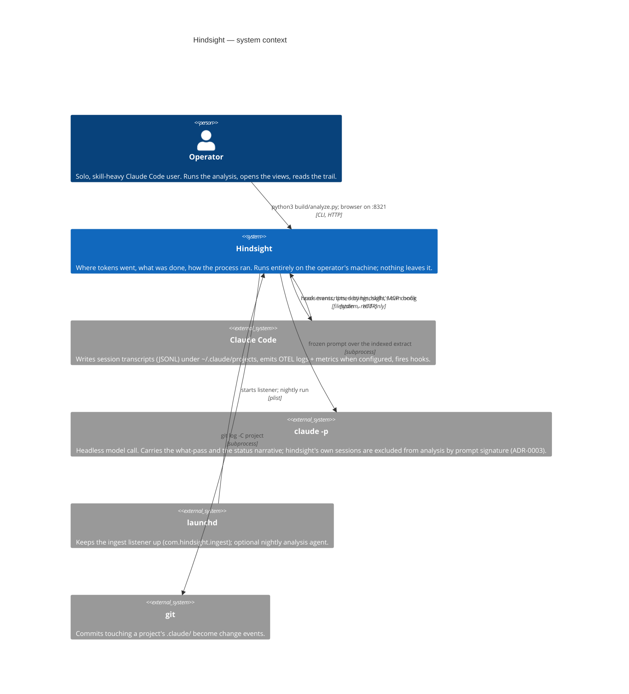
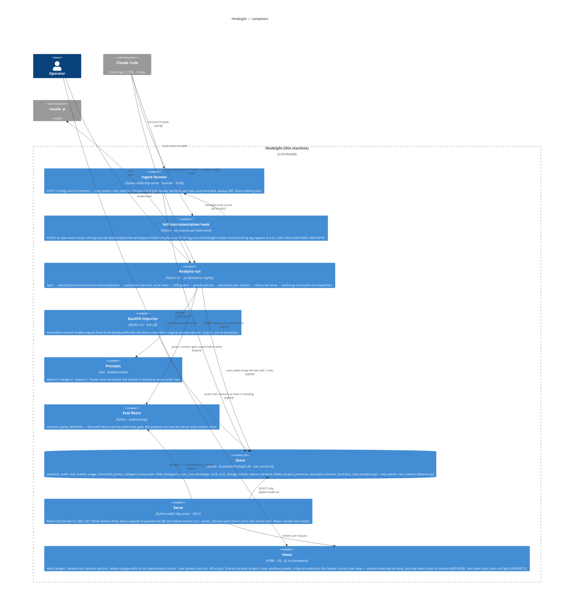
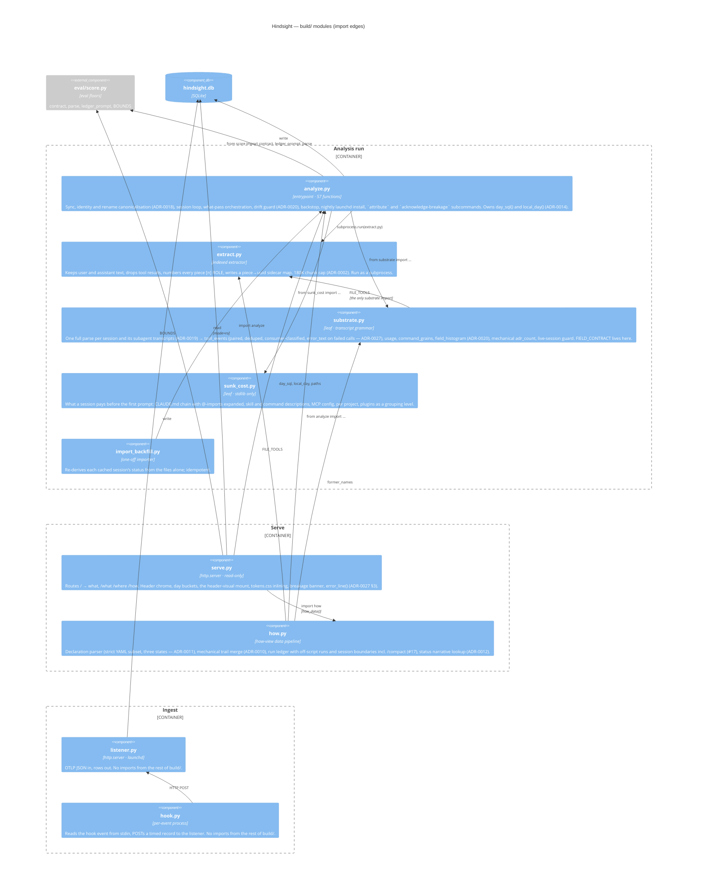

# Architecture — C4

Local observability over Claude Code history for one operator. Three levels: who and what
it talks to, the runnable pieces and the store between them, and the Python modules behind
the analysis run and the server.

**Basis:** the code in `build/` at schema version 9 (`PRAGMA user_version`, `analyze.init_db`),
module docstrings, and ADR-0001 → 0027. Where this document and the code disagree, the code
is right; re-derive when a module is added, split, or gains a cross-directory import.
Vocabulary is in [CONTEXT.md](../CONTEXT.md); each decision cited below is in [adr/](adr/).

**Key assumptions the whole design rests on:** one operator, one machine, one Unix user;
`~/.claude/projects/**/*.jsonl` is the archive and survives independently of anything here;
the model is reachable only as the `claude` CLI on `PATH`; nothing leaves the machine.

## L1 — System context

- **No daemon beyond the listener.** ADR-0001: the ingest listener is the one sanctioned background process. Everything else is on-demand foreground, started to look and closed when done.
- **The model is a subprocess, not a service.** No API key, no SDK — `claude -p` on PATH, serial, one call at a time. Missing CLI or a usage limit pauses the run rather than crashing it (`analyze.py:1250-1271`).
- **Nothing is written back to Claude Code.** Transcripts and config are read; the only outbound write is the hook's POST into hindsight's own listener.
- **Three views, not four.** The so-what view (ADR-0021 → 0025) was designed and then dropped after its dry run (ADR-0026). Nothing of it exists in `build/` or `eval/`: no route, no Stage A function, none of ADR-0024's indexes. CONTEXT.md keeps its terms as history only.

## L2 — Containers

The picture is an [Archify](https://github.com/tt-a1i/archify) export of [diagrams/architecture.archify.json](diagrams/architecture.archify.json), the same containers as the Mermaid below. The Mermaid is the source of truth for this document; the Archify spec is re-derived from it when a container is added or removed, and the SVG is re-exported from the viewer (`archify deliver architecture docs/diagrams/architecture.archify.json <out.html>`, then Export → SVG). The interactive HTML is not committed.

- **Write and read never share a process.** Ingest and analysis write; serve opens the DB read-only and has no run button (ADR-0008). Refresh is a browser reload.
- **Two ingest paths, one store.** OTEL arrives live through the listener; transcripts are parsed after the fact by the analysis run. Both land in SQLite and the where-view joins them.
- **`eval/` is a runtime dependency, not just a test suite.** `analyze.py` puts `eval/` on `sys.path` and imports `score` (`analyze.py:205`); the eval floors gate what gets written. This is the one cross-directory import in the system.
- **The design contract is inlined, not linked.** `design/tokens.css` is read by serve at render time (`serve.py:697`), so a token edit shows on next reload with no build step.
- **Schema and migrations live in one place.** `SCHEMA` plus the `user_version`-gated sniffs in `analyze.init_db` (`analyze.py:214-543`). v8 (drift-guard baseline) and v9 (error text) each reset the scanned marker and refill the substrate from surviving transcripts; a vanished transcript keeps its old rows.

## L3 — Components: the `build/` Python modules

- **Import direction is enforced by design, not tooling.** `substrate.py` and `sunk_cost.py` are leaves: analyze, how and serve import them, never the reverse. Substrate's one `build/` import is `FILE_TOOLS` from extract.
- **Ingest is fully decoupled.** `listener.py` and `hook.py` share no code with the analysis or serve side; their only coupling is the `otel_events` table shape.
- **`analyze.py` is the god module.** 57 functions, 1,700 lines: the sync loop, the model call, the schema and every migration, the drift guard, the backstop, the launchd install and three subcommands. Serve and how both reach into it for day bucketing and paths. The day helpers and the schema remain the two obvious seams if a split is ever wanted.
- **Prompts and assets are data.** `build/prompts/*.txt` and `build/assets/*` are read at run time; no module owns them beyond the path constant.
- **The error line is a view concern.** `serve.error_line` (`serve.py:482-503`) derives the grouping key from stored `error_text` at render; the browser (`where.js:106-122`) only groups and renders. Tuning the rules never costs a rescan (ADR-0027 §3).

## Stack

| Layer | Choice | Where |
| --- | --- | --- |
| Language | Python 3 stdlib only — no pip dependencies (ADR-0003) | `build/*.py`, `eval/score.py` |
| Store | SQLite, one file `local-data/hindsight.db`, WAL; schema and migrations owned by `analyze.py`, gated by `PRAGMA user_version` (currently 9) | `build/analyze.py:214-543` |
| HTTP | `http.server.ThreadingHTTPServer`, twice: ingest `:4318` and serve `:8321`, both bound to `127.0.0.1` | `build/listener.py:209`, `build/serve.py:784` |
| Model | `claude -p --model claude-haiku-4-5-20251001` as a subprocess, prompt on stdin, 300 s timeout | `build/analyze.py:186,206,1252` |
| Scheduling | launchd user agents `com.hindsight.ingest` (KeepAlive) and `com.hindsight.nightly` (03:00, PATH and `HINDSIGHT_TZ` baked in at install) | `build/listener.py:189-223`, `build/analyze.py:1584-1617` |
| UI | Server-rendered HTML with inlined CSS/JS, no framework, no fetches, no external URLs | `build/assets/`, `design/tokens.css` |

## Auth, identity and sessions

There are none, by design. Hindsight is a single-operator tool that runs as the operator's own
macOS user: the only principal is the Unix user, the only credential is filesystem ownership of
`local-data/`, and the only network exposure is loopback. Neither server checks a token, cookie,
origin or header (`listener.py:130-176`, `serve.py:761-784`). "Sessions" in this codebase mean
Claude Code sessions (transcripts), not login sessions. See [permissions.md](permissions.md).

## Trust boundaries

| Boundary | Crossing | What is trusted on the far side |
| --- | --- | --- |
| Claude Code → listener | OTLP/HTTP JSON POST on loopback | Anything that can reach `127.0.0.1:4318` — every local process. Content type must be `application/json` (`415` otherwise, which keeps a visited web page out) and the body is capped at 8 MiB declared, chunked or inflated (#34); no auth; unknown paths answered `200`. |
| Claude Code → hook | JSON on stdin, one process per event | The hook reads `session_id`, `hook_event_name` and, at SessionStart only, `cwd` — which it `stat`s for the folder inode (`hook.py:69-77`). Everything else on stdin is dropped. Cannot block or alter the action (exit 0, empty stdout, every exception swallowed). |
| Analysis run → `~/.claude` | Read-only filesystem walk | Transcripts and config are treated as data. Only user/assistant prose reaches the model (`extract.py`). **One kind of transcript content is stored:** the verbatim result text of a *failed* tool call (`tool_events.error_text`, `substrate.py:259-263`); nothing of a successful call, ever (ADR-0027 §2). |
| Analysis run → `claude -p` | Prompt on stdin, markdown/JSON on stdout | Model output is **untrusted**: gated by `valid_entry` (what-pass, `analyze.py:1105`) and `score.contract` + `BOUNDS` (narrative) before any write. Raw output is cached on disk only. |
| Analysis run → project git repos | `git -C <repo> log/diff-tree/show -- .claude` | Full historical contents of every `.claude/*` file are copied verbatim into `blobs` (`analyze.py:1303-1329`). |
| Serve → browser | GET on loopback, read-only DB (`mode=ro`) | Page content comes from the DB, which now contains model prose *and* raw error text. Both are HTML-escaped: `what.js` re-injects `**b**`/`` `code` `` from escaped text; error text goes into `<pre>` through `esc()` (`where.js:119`). |
| Browser → anywhere | — | Nothing. No fetch, no external assets, one `localStorage` key (`theme`) and one per-tab `sessionStorage` key (`filter`). |

## Known risks and assumptions

Each entry is a fact about the code as written, not a checklist item. Ordered by what crossing it exposes.

1. **Secrets can land in the DB.** `capture_backstop` stores the full text of `~/.claude/settings.json`, `settings.local.json`, `mcp.json` and `plugins/installed_plugins.json` in `blobs.content` (`analyze.py:1371-1380`), and `_capture_project_git` stores every historical version of every `.claude/*` file in every workspace repo (`analyze.py:1324-1328`). Settings and MCP config commonly carry API keys. `local-data/` is gitignored and the DB is never served raw, but a copy of `hindsight.db` is a copy of those files. See [variables.md](variables.md).
2. **Error text is transcript content, stored uncapped and rendered.** `tool_events.error_text` holds a failed call's result verbatim — file paths, command lines, whatever the tool echoed — with no length cap (`substrate.py:266-275`), and the where view renders the full text under each grouped error line. The stated boundary rule (ADR-0027 §2) is the only thing between this column and "one more column" for successful results or tool inputs; nothing in the code enforces it. Screenshots of an opened league row need a per-image check for home paths — the pre-commit denylist cannot read a PNG.
3. **The listener trusts loopback wholesale.** Any local process can POST arbitrary JSON to `:4318`; since #34 the content type must be `application/json` (which keeps a browser page out) and the declared, chunked and inflated body sizes are all capped at `MAX_BODY` 8 MiB (`listener.py:158-179`). A DB error drops the whole batch but reports `rejectedLogRecords: 1` and still returns `200`, so the exporter never retries (`listener.py:190-201`).
4. **Hook events are fire-and-forget.** Listener down → event lost; no spool, no retry (`hook.py:116-123`). Coverage gaps are drawn as gaps by the views (ADR-0001 honesty rule), but the data is gone.
5. **Reader and writers share one DB file — WAL since issue #12, 30 s reader timeout.** A nightly write no longer 500s a page. Writers still serialise: a single `analyze.py` write transaction longer than the listener's 5 s `busy_timeout` — `capture_backstop`, which runs every repo's git subprocesses inside one transaction (`analyze.py:1368-1394`) — can still drop an ingest batch. See [cron.md](cron.md).
6. **Model prose is rendered as restricted markdown.** `what.js:5-6` HTML-escapes then converts `**x**` and `` `x` `` back into `<b>`/`<code>`. The escape happens first, so no tag survives; the surface is the regex, not the data. Session UUIDs go into `data-id` attributes unescaped (`what.js:25`) and are read back from `location.hash` through `CSS.escape` (`what.js:63-65`).
7. **Project names from the DB build filesystem paths.** `how.py:360-363` and `serve.py:516` join `sessions.project` (and every former name) onto the workspace dir without sanitising; the read is confined to a fixed `.claude/my-process.md` suffix (`how.py:182`). Names come from transcript directory names (`sync_sessions`, `analyze.py:688`); a traversal would need a directory named with `../`, which Claude Code does not produce.
8. **Extracts and raw model output live on disk in plain text** under `local-data/analysis/` — user and assistant message text at 1,500 chars per piece — plus `~/Library/Logs/hindsight/analyze.log` echoing the first 80 chars of any rejected model output (`analyze.py:1128`). Gitignored; not encrypted.
9. **The launchd jobs pin an absolute Python path, repo path and the installing shell's `PATH`** (`analyze.py:1596-1602`, `listener.py:216-218`). Move the repo, upgrade Homebrew Python, or install from a shell whose `PATH` lacks `claude`, and the agents fail into their log files.
10. **No rate or cost ceiling on the model loop beyond serial execution.** A run processes every selectable session one call at a time until `LimitExhausted` (`analyze.py:1552-1560`); the only cap is the CLI's own limit, detected by a bare `"limit"` substring on stderr (`analyze.py:1268`).
11. **The drift guard and the narrative pass fail open.** Both are wrapped in `except Exception` that prints one line and carries on (`analyze.py:1540-1544`, `1568-1574`) — by decision (#77: never trade mechanical fact for a nicety), but a bug in either is a log line, not a stopped run. The guard also cannot see a CLI that drops the `version` key itself (ADR-0020).

## Related documents

- [flows.md](flows.md) — the runtime paths (ingest, hook, analysis run, serve) with their trust crossings and side effects.
- [permissions.md](permissions.md) — the single-principal model and the resource × operation matrix.
- [variables.md](variables.md) — configuration, paths and the secret surface.
- [cron.md](cron.md) — the two launchd agents and what makes a re-run safe.
- [automation.md](automation.md) — the two model passes: tool surface, gates, and app-owned side effects.
- [adr/](adr/) — decisions 0001 → 0027; 0021–0025 record a view that was dropped (0026).
- [diagrams/](diagrams/) — the Archify spec and SVG export of the L2 container view; a presentation object, re-derived from the Mermaid above.
- [agents/](agents/) — for the next coding agent: [domain.md](agents/domain.md), [issue-tracker.md](agents/issue-tracker.md), [triage-labels.md](agents/triage-labels.md).
- No transactional email — no `emails.md`. No public or indexable routes (loopback only) — no `seo.md`. `tests.md` is not yet derived (`/derive-tests`).
- Vocabulary: [CONTEXT.md](../CONTEXT.md).
